# v0.1.0 - Initial Release / 初回リリース

**リリース日 / Release Date:** 2026-01-29

---

## 日本語 / Japanese

### 概要

Cinderella の初回リリースようこそ！これは Claude Code CLI を FastAPI でラップしたローカルHTTPサーバーです。魔法のように簡単に Claude Code をHTTP APIとして使えるようになります。

### 新機能

- **FastAPI サーバー実装**: Claude Code CLI を HTTP API として公開
- **Docker/Docker Compose 対応**: ワンコマンドで環境構築完了
- **GLM モデル対応**: Z.AI（智谱AI）の GLM-4.5/4.7 モデルがデフォルトで設定済み
- **公式 Claude モデル対応**: Anthropic API も切り替えて使用可能
- **ヘルスチェックエンドポイント**: `/health` でサーバー状態確認
- **実行エンドポイント**: `/v1/claude/run` で Claude Code 実行

### テスト

- 基本テストスイート実装
- サイコロアプリ作成テスト追加

### ドキュメント

- README に Docker セットアップ手順を追加
- テストドキュメント追加
- プロジェクトヘッダー画像追加

### その他

- Python 3.13+ 対応
- `.env.example` テンプレート追加
- `.gitignore` 設定（workspace、Claude 設定ディレクトリ除外）
- SourceSage 無視ファイル設定
- LICENSE ファイル追加（MIT）

---

## English

### Overview

Welcome to the first release of Cinderella! This is a local HTTP server that wraps Claude Code CLI with FastAPI. Magic that lets you use Claude Code as an HTTP API with ease.

### What's New

- **FastAPI Server Implementation**: Exposes Claude Code CLI as HTTP API
- **Docker/Docker Compose Support**: One-command environment setup
- **GLM Model Support**: Pre-configured for Z.AI GLM-4.5/4.7 models by default
- **Official Claude Model Support**: Switchable to Anthropic API
- **Health Check Endpoint**: Server status check via `/health`
- **Execution Endpoint**: Run Claude Code via `/v1/claude/run`

### Tests

- Basic test suite implemented
- Dice app creation test added

### Documentation

- README with Docker setup instructions
- Test documentation added
- Project header images added

### Changes

- Python 3.13+ support
- `.env.example` template added
- `.gitignore` configuration (workspace, Claude config directories excluded)
- SourceSage ignore files configured
- LICENSE file added (MIT)

---

## Quick Start / クイックスタート

```bash
# 1. APIキーを設定 / Set API key
cp .env.example .env
# Edit .env with your Z.AI or Anthropic API key

# 2. Dockerで起動 / Start with Docker
docker compose up -d

# 3. 動作確認 / Verify
curl http://127.0.0.1:8081/health
```

---

## Magic Footnote

> "A dream is a wish your heart makes"
>
> このプロジェクトは、Claude Code をより使いやすく、より魔法のようにするために作られました。
>
> This project was created to make Claude Code more accessible, like magic.
